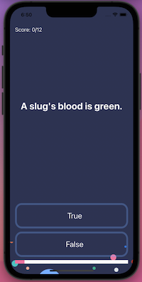

#  Quizzler

<h4 align="center">A simple Quiz game</h4>

  •<a href="#key-features">Key Features</a>
  •<a href="#how-to-use">How To Use</a> 

 

## Key Features

* UIKit
* MVC
* Structs
* Array of structs
* Inputs and return types
* UIProgressView

## How To Use

A simple quizz game where you have to choose true or false. You can see your score on top and restart the game when you finish.
